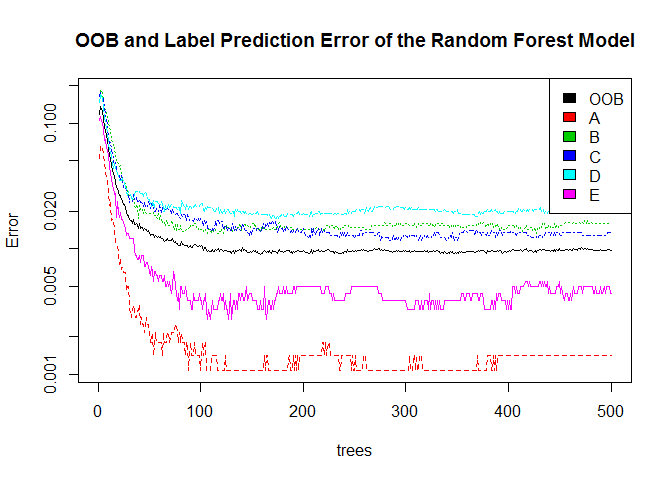

###Practical Machine Learning Course Project

####Overview

Using devices such as Jawbone Up, Nike FuelBand, and Fitbit it is now possible to collect a large amount of data about personal activity relatively inexpensively. These type of devices are part of the quantified self movement - a group of enthusiasts who take measurements about themselves regularly to improve their health, to find patterns in their behavior, or because they are tech geeks. One thing that people regularly do is quantify how much of a particular activity they do, but they rarely quantify how well they do it. In this project, the goal will be to use data from accelerometers on the belt, forearm, arm, and dumbell of 6 participants to predict the manner in which they did the exercise.

####How the Model is built

#####Getting and Cleaning Data
First, download and read the data. Testing data is for Prediction Assignment Submission  but we will still download and process the data here. More information about the data is available from this website: http://groupware.les.inf.puc-rio.br/har (see the section on the Weight Lifting Exercise Dataset).


```r
#Download the data if it isn't downloaded yet
csvTrain <- "pml-training.csv"
if(!file.exists(csvTrain)) {
  urlTrain <- "https://d396qusza40orc.cloudfront.net/predmachlearn/pml-training.csv"
  download.file(urlTrain,csvTrain)
}
csvTest <- "pml-testing.csv"
if(!file.exists(csvTest)) {
  urlTest <- "https://d396qusza40orc.cloudfront.net/predmachlearn/pml-testing.csv"
  download.file(urlTest,csvTest)
}

#Reading data
naStr <- c("", "NA", "#DIV/0!") #DIV/0! exists in Testing data
dfTrain <- read.csv(csvTrain, na.strings=naStr)
dfTest <- read.csv(csvTest, na.strings=naStr)
```

Reduce the number of predictor by:
- Removing variables with nullity > 95%
- Including only variables that are measurement readings from the devices which their labels contain arm, belt and dumbbell.


```r
col <- colSums(is.na(dfTrain))/nrow(dfTrain)<=0.95
dfTrain <- dfTrain[, col]
dfTrain <- dfTrain[, grep("classe|.*arm.*|.*belt.*|.*dumbbell.*", colnames(dfTrain))]
dfTest <- dfTest[, col]
dfTest <- dfTest[, grep("problem_id|.*arm.*|.*belt.*|.*dumbbell.*", colnames(dfTest))]
```

#####Cross Validation

Before the final model is created/trained, the data will be separated into 2 partitions, 50% of the data used to create/train the model while another 50% used to validate/test the model.


```r
set.seed(1)
library(caret)
```

```
## Loading required package: lattice
## Loading required package: ggplot2
```

```r
i <- createDataPartition(dfTrain$classe, p=0.5, list=FALSE)
dfTrain.train <- dfTrain[i, ]
dfTrain.test  <- dfTrain[-i, ]
```

#####Building the Model


```r
library(randomForest)
```

```
## randomForest 4.6-10
## Type rfNews() to see new features/changes/bug fixes.
```

```r
model <- randomForest(classe ~ ., data=dfTrain.train)
model
```

```
## 
## Call:
##  randomForest(formula = classe ~ ., data = dfTrain.train) 
##                Type of random forest: classification
##                      Number of trees: 500
## No. of variables tried at each split: 7
## 
##         OOB estimate of  error rate: 0.98%
## Confusion matrix:
##      A    B    C    D    E class.error
## A 2786    2    0    0    2 0.001433692
## B   19 1869   11    0    0 0.015797788
## C    0   17 1688    6    0 0.013442431
## D    1    0   27 1577    3 0.019278607
## E    0    0    0    8 1796 0.004434590
```

```r
plot(model, log="y", main="OOB and Label Prediction Error of the Random Forest Model")
legend("topright", colnames(model$err.rate), fill=1:6)
```

 

The generated model shows that OOB (Out-of-Bag) or **Out-of-Sample** estimate of error rate is 0.98%. We will compare and cross-check this with the result from Cross Validation later.

####Testing the Model

After model is built/trained, we then use the partitioned testing data to cross validate its prediction accuracy and display the result in Confusion Matrix.


```r
mat <- confusionMatrix(predict(model, newdata=dfTrain.test[, -53]), dfTrain.test$classe)
mat
```

```
## Confusion Matrix and Statistics
## 
##           Reference
## Prediction    A    B    C    D    E
##          A 2782   14    0    0    0
##          B    7 1881   18    0    0
##          C    0    3 1690   22    0
##          D    0    0    3 1585    3
##          E    1    0    0    1 1800
## 
## Overall Statistics
##                                           
##                Accuracy : 0.9927          
##                  95% CI : (0.9908, 0.9943)
##     No Information Rate : 0.2844          
##     P-Value [Acc > NIR] : < 2.2e-16       
##                                           
##                   Kappa : 0.9907          
##  Mcnemar's Test P-Value : NA              
## 
## Statistics by Class:
## 
##                      Class: A Class: B Class: C Class: D Class: E
## Sensitivity            0.9971   0.9910   0.9877   0.9857   0.9983
## Specificity            0.9980   0.9968   0.9969   0.9993   0.9998
## Pos Pred Value         0.9950   0.9869   0.9854   0.9962   0.9989
## Neg Pred Value         0.9989   0.9978   0.9974   0.9972   0.9996
## Prevalence             0.2844   0.1935   0.1744   0.1639   0.1838
## Detection Rate         0.2836   0.1917   0.1723   0.1616   0.1835
## Detection Prevalence   0.2850   0.1943   0.1748   0.1622   0.1837
## Balanced Accuracy      0.9976   0.9939   0.9923   0.9925   0.9990
```

According to the result of Confusion Matrix above, the cross validation archieve Accuracy 0.9926606. Its error rate 0.0073394 (1 - Accuracy) is comparable with the OOB or **expected Out-of-Sample error** rate suggested by the model.

####Predict for the Testing cases/data


```r
answer <- predict(model, newdata=dfTest[, -53])
answer
```

```
##  1  2  3  4  5  6  7  8  9 10 11 12 13 14 15 16 17 18 19 20 
##  B  A  B  A  A  E  D  B  A  A  B  C  B  A  E  E  A  B  B  B 
## Levels: A B C D E
```

```r
#Function to output answer to text file
pml_write_files <- function(x) {
  n <- length(x)
  for(i in 1:n) {
    filename <- paste0("problem_id_",i,".txt")
    write.table(x[i], file=filename, quote=FALSE, row.names=FALSE, col.names=FALSE)
  }
}
pml_write_files(answer)
```

####Conclusion
This model is acceptable due to its low OOB or **expected Out-of-Sample error** rate and the high accuracy result from cross validation, even though it is built/trained using only 50% of the data.

<br><br><br>
